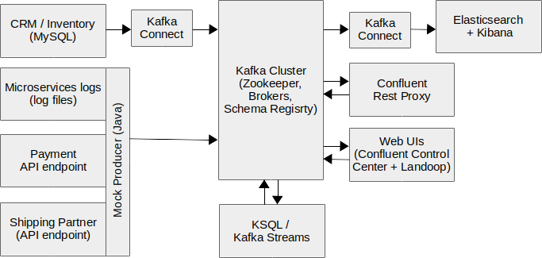

# ipt-Confluent Workshop :: Kafka Bookstore Tutorial

## This tutorial

In this tutorial, we will demonstrate several aspects of Kafka.

 1. Use Case
 1. Architecture
 1. Running Platform
 1. Stream Data into Kafka
 1. Stream Data Transformation with KSQL
 1. Stream data Transformation with Kafka Streams
 1. Stream data out of Kafka

## Use Case

The Kafka Bookstore is an online shop specialized in books by or about Franz Kafka.

It uses Apache Kafka as its messaging platform, due to its singular characteristics:

 - Data streaming in real time, supports also batching
 - Decouples microservices with event driven architecture
 - Integrated storage, which allows messages to be replayed in the future
 - Wide range of connectors to import and export data into and out of it (Kafka Connect)
 - Stream analysis and transformations with KSQL and Kafka Streams
 - Elasticity, scalability, robustness, and high availability
 - Cloud native
 - Open source with active community
 - Excellent tools and support from Confluent ;)
 - It’s awesome!

Since a couple of weeks now, a minimum viable product (MVP) has been released and it’s attracting a lot of attention. 
The workflow is the following:

 1. Customer signs up/logs in
 1. Customer browses books
 1. Customer adds products to cart
 1. Customer places an order
 1. Customer pays (informed by third-party payment partner)
 1. Order is shipped (informed by shipping partner)
 1. Shipment is delivered or lost (informed by shipping partner)

Kafka is used as a data streaming platform, to decouple microservices and transform events.

## Architecture

As seen in the diagram below, there are source systems that produce events (i.e. write data to Kafka) and target systems 
that will consume events. We will also use Kafka to transform and aggregate events.

### Source systems

The following systems  

#### CRM and Inventory Management System

We assume there is a CRM and Inventory Management System system that holds information regarding customers and products.
The systems that manage them use MySQL to keep their data. 
All the needed information can be found in the “customer” and “product” tables.
As part of this tutorial, we'll use Kafka Connect and a CDC (change data capture) tool to stream all updates to those 
tables in real time to Kafka.

#### Mocked Components

The following components do not actually exist. The events that would be produced by them are mocked by a Java producer.

##### Microservices logs

When a user views a product or adds an item in the shopping cart, an event is produced to the topic “interaction”.
When an order is placed, then the event is published to the topic “purchase”. The field “packet” is null at first, then
updated as soon as the order is shipped. But the order isn’t shipped before it’s paid for!

##### Payment Partner

The Payment Notification microservice knows when customers have paid for an order (it calls an API, is called by a 
webhook, triggered by a file transfer, whatever), and produces a message in the “payment” topic when it happens.
For simplicity, all orders are paid in full.

##### Shipping Partner

Once the order is paid for, it is shipped. First, the “purchase” topic is updated with the packet id.
The Shipping Notification microservice is triggered by the shipping company (let’s say an API is called) and updates the
topic “shipping” with statuses “underway”, “delivered”, or “lost”.

### Target systems

**TODO**

### Topic recap

**TODO**

## Running Platform

Your choice: Local docker images or use VirtualBox image.

If you have an outdated laptop (i.e. with less than 16 GB RAM), please have a look 
[here](https://ipt.jiveon.com/docs/DOC-2169).

### Prerequisites

### Local

Please install:

* Docker and Docker Compose
* Git, Maven, and a Java IDE
* JDK 8

Then clone this repository: https://github.com/fabiohecht/kafka-bookstore-tutorial.git

### VirtualBox image

Please install Virtual Box and get the image from a USB stick (ask Fabio).
It already has Docker and all the stuff in it.

### Get the platform started   

Let's first make sure you have all last-minute changes. Open a terminal and type:

    cd IdeaProjects/kafka-bookstore-tutorial
    git pull
    
Now let's start all Docker containers. Open a terminal and type:

    cd docker-compose
    docker-compose up -d

To see which containers are running and their statuses:

    docker-compose ps

It may take like a minute until all is running. You can see the logs of each container by typing:

    docker-compose logs [image-name]

On my machine, the elasticsearch image could not start, 

    elasticsearch         | [2018-05-24T15:20:11,779][INFO ][o.e.b.BootstrapChecks    ] [nw0uKIe] bound or publishing to a non-loopback address, enforcing bootstrap checks
    elasticsearch         | ERROR: [1] bootstrap checks failed
    elasticsearch         | [1]: max virtual memory areas vm.max_map_count [65530] is too low, increase to at least [262144]

Fix was doing a:

    sudo sysctl -w vm.max_map_count=262144

Kafka command-line tools:

    TODO

You should be able to use a browser and see a few web UIs running:
      
 - Confluent Control Center: http://localhost:9021
 - Landoop Kafka Topics UI: http://localhost:8000
 - Landoop Confluent Schema Registry UI: http://localhost:8001
 - Landoop Kafka Connect UI: http://localhost:8003
 - Kibana web UI: http://localhost:5601

The Web UIs are useful to visualize some information. There are also command line tools and APIs that are more powerful.

## Stream Data into Kafka

We will use Kafka Connect to stream two MySQL tables to Kafka topics, and start a Java application that
mocks events.

### MySQL Kafka Connect

A MySQL Server was started by Docker Compose and preloaded with mock data. You can check it out with:

    docker-compose exec mysql mysql -p kafka-bookstore
    Enter password: secret

[**TODO** copy paste]

When you are done, exit with crtl+D.

**TODO** set up debezium to CDC it across (can then demo realtime changes of data in DB reflecting in Kafka + KSQL processing)

**TODO** Kafka Connect config.

Check that imported data looks ok. You can use the Landoop Topics UI and look at the data in the "book" and "customer"
topics. Or go old-school with the command line (we use the kafka-connect container just because it has the command
line tools installed):

    docker-compose exec kafka-connect kafka-avro-console-consumer --bootstrap-server kafka:29092 --topic book --from-beginning --property schema.registry.url=http://schema-registry:8081

Press CTRL-C to exit.

[**TODO**] Change data in MySQL and see that Kafka gets updated.

### Start Java Mock Producer

Let's start the Java Mock event producer. All of this can be done from IntelliJ's, which is contained in the VM.
Let's first compile the project with Maven. On the right-hand side of IntelliJ's window, under "Maven Projects", 
"Lifecycle", double click "clean", then double click "package".

 * On the project navigator (left part of the screen), navigate to src/main/java/...producer. 
 * Open the class MockProducer. Have a look at how we produce events to Kafka by calling producer.send().
 * Run the MockProducer -- right click file name and "Run 'MockProducer.main()'.
 * If all goes well, we are producing mock events to Kafka!

Like before, you can use the kafka-avro-console-consumer or Landoop's UI to see the events coming in your topics. 
You can choose whether to keep it running in the background or to stop it now and start when you want events to be produced.

In real life, a Java Spring Boot microservice could expose an API that, when called by the Shipping partner or the Post,
produces the event.

#### If you want to dig in deeper

For more information about the data schemas used, have a look at src/main/resources/avro/Schemas.avsc. These are defined
in Avro format, which is fairly human-readable (Json). The spec can be found at http://avro.apache.org/docs/1.8.2/spec.html.
When the project is compiled with maven, the Java classes for the data model are generated, as specified in the pom.xml
file under &lt;buld>&lt;plugins>. You can test it with “mvn clean compile” from the command line (current directory is project
root) or using IntelliJ’s “Maven Project” tool button (seen on the right-hand side), under kafka-bookstore-tutorial, 
Lifecycle, double click “clean”, double click “compile”.

## Stream Data Transformation with KSQL

KSQL is a new product from Confluent officially released in March 2018... [TODO shortly describe KSQL]

Launch the KSQL cli:

    docker-compose exec ksql-cli ksql http://ksql-server:8088

### Explore topics

    SHOW TOPICS;
    PRINT 'interaction' FROM BEGINNING;

Press ctrl-C to cancel

If the Java producer is running, then run:

    PRINT 'interaction'

to see a live feed of messages being added to the topic (note the ommission of `FROM BEGINNING`)

### Register stream and tables

    CREATE TABLE BOOK with (kafka_topic='book', VALUE_FORMAT='AVRO', key='bookId');
    CREATE TABLE CUSTOMER with (kafka_topic='customer', VALUE_FORMAT='AVRO', key='customerId');
    CREATE TABLE PURCHASE with (kafka_topic='purchase', VALUE_FORMAT='AVRO', key='purchaseId');
    CREATE TABLE PAYMENT with (kafka_topic='payment', VALUE_FORMAT='AVRO', key='transactionId');
    CREATE STREAM SHIPPING with (kafka_topic='shipping', VALUE_FORMAT='AVRO');
    CREATE STREAM INTERACTION with (kafka_topic='interaction', VALUE_FORMAT='AVRO');
    CREATE STREAM PURCHASE_STREAM with (kafka_topic='purchase', VALUE_FORMAT='AVRO');
    CREATE STREAM PAYMENT_STREAM with (kafka_topic='payment', VALUE_FORMAT='AVRO');

### Explore objects

    describe interaction;

    SET 'auto.offset.reset' = 'earliest';
    SELECT * FROM INTERACTION LIMIT 5;

### How many views have there been per category, per 30 second window?

    CREATE TABLE pageviews_categories AS \
    SELECT categories , COUNT(*) AS num_views \
    FROM INTERACTION \
    WINDOW TUMBLING (size 30 second) \
    WHERE event='view' \
    GROUP BY categories;

    SELECT TIMESTAMPTOSTRING(ROWTIME, 'yyyy-MM-dd HH:mm:ss') , CATEGORIES, NUM_VIEWS FROM pageviews_categories;

    2018-05-17 14:57:30 | Kafka, Franz, 1883-1924 | 1
    2018-05-17 14:57:30 | Language Arts & Disciplines | 2
    2018-05-17 14:57:30 | History | 1
    2018-05-17 14:56:30 | Authors, Austrian | 4
    2018-05-17 14:57:00 | Education | 1
    2018-05-17 14:57:00 | Biography & Autobiography | 1
    2018-05-17 14:57:00 | Authors, Austrian | 4
    2018-05-17 14:57:00 | Grotesque in literature | 1

### For each purchase, add customer details

Sample Purchase data:

    5/17/18 8:09:42 PM UTC, 60a7ba13-af98-4e98-ba0f-d45e5e83923c, {"purchaseId": "60a7ba13-af98-4e98-ba0f-d45e5e83923c", "customerId": 52, "bookIds": ["2tTdnAEACAAJ", "zBskDwAAQBAJ", "FbPQPwAACAAJ", "kHnrswEACAAJ", "Fr7vCgAAQBAJ", "ym9rAgAAQBAJ", "0JYeJp1F99cC", "IkAzf9IRVpIC", "KdDqtq_CemwC", "beYRAAAAQBAJ", "d0RcAAAAMAAJ"], "packet": null, "totalAmount": 28901}

Sample Customer data:

    5/17/18 2:54:39 PM UTC, 85, {"customerId": 85, "firstname": "Cordey", "lastname": "Targett", "email": "ctargett2c@mediafire.com", "street": "Rusk", "number": "00", "zip": "854", "city": "Frankfurt am Main", "country": "DE"}

Query:

    ksql> SELECT P.purchaseId, p.totalAmount, c.firstname + ' ' + c.lastname as full_name, c.email, c.city, c.country FROM PURCHASE_STREAM p LEFT JOIN CUSTOMER c on p.customerId=c.customerId LIMIT 1;
    f5d4e42f-c82f-4228-940e-19d6ddbf622c | 1500 | Cordey Targett | ctargett2c@mediafire.com | Frankfurt am Main | DE
    LIMIT reached for the partition.
    Query terminated

Persist this enriched stream, for external use and subsequent processing

    CREATE STREAM Purchase_enriched AS SELECT P.purchaseId, p.totalAmount, c.firstname + ' ' + c.lastname as full_name, c.email, c.city, c.country FROM PURCHASE_STREAM p LEFT JOIN CUSTOMER c on p.customerId=c.customerId;

### What's the geographical distribution by city of orders placed by 30 minute window?

    ksql> SELECT city,COUNT(*) FROM Purchase_enriched WINDOW TUMBLING (SIZE 30 MINUTES) GROUP BY city;

    Limoges | 3
    Caen | 3
    Limoges | 4
    Brest | 4
    Düsseldorf | 7
    Armentières | 12
    Mayenne | 4
    London | 5

Persist it as a kafka topic:

    ksql> CREATE TABLE PURCHASE_COUNT_BY_CITY_PER_30MIN AS SELECT city,COUNT(*) as purchase_count FROM Purchase_enriched WINDOW TUMBLING (SIZE 30 MINUTES) GROUP BY city;

     Message
    ---------------------------
     Table created and running
    ---------------------------

Query it:

    ksql> SELECT TIMESTAMPTOSTRING(ROWTIME, 'yyyy-MM-dd HH:mm:ss') , CITY, PURCHASE_COUNT FROM PURCHASE_COUNT_BY_CITY_PER_30MIN;

    2018-05-17 20:30:00 | La Rochelle | 2
    2018-05-17 20:30:00 | Poitiers | 1
    2018-05-17 20:30:00 | Le Mans | 1

### Trigger an event if a purchase is made over a given value

    CREATE STREAM BIG_PURCHASE AS SELECT * FROM PURCHASE_STREAM WHERE totalAmount>30000;

The resulting Kafka topic could be used to drive fraud checks, automatically hold orders, etc.

### Analytics: views per book

    ksql> select b.title, count(*) as view_count from interaction i left join book b on i.Id = b.bookId where i.event='view' group by b.title;
    Fremdheit in Kafkas Werken und Kafkas Wirkung auf die persische moderne Literatur | 34
    'Vor dem Gesetz' - Jacques Derridas Kafka-Lektüre | 23
    In der Strafkolonie | 59
    Kafka und Prag | 72

**TODO** describe result?

### What the total value of payments, per 5 second window?

(https://github.com/confluentinc/ksql/issues/430)

    CREATE STREAM PAYMENT2 AS SELECT 1 AS DUMMY,AMOUNT FROM PAYMENT_STREAM;
    CREATE TABLE TOTAL_PAYMENTS_BY_5SEC AS SELECT DUMMY, SUM(AMOUNT) AS TOTAL_AMOUNT FROM PAYMENT2 WINDOW TUMBLING (SIZE 5 SECONDS) GROUP BY DUMMY;
    SELECT TIMESTAMPTOSTRING(ROWTIME, 'yyyy-MM-dd HH:mm:ss') , TOTAL_AMOUNT FROM TOTAL_PAYMENTS_BY_5SEC;
    2018-05-17 21:36:35 | 26750
    2018-05-17 21:36:30 | 44200
    2018-05-17 21:36:50 | 25199
    2018-05-17 21:36:55 | 42051
    2018-05-17 21:37:00 | 10700

### top 5 sold books by revenue (ideally join with payments to exclude unpaid orders + join with book to get author name)

CREATE STREAM purchasest with (kafka_topic='purchase', VALUE_FORMAT='AVRO', key='purchaseId');

SELECT bookIds, TOPK(totalAmount, 5) \
FROM purchasest \
WINDOW TUMBLING (SIZE 1 HOUR) \
GROUP BY bookIds;

### Average ticket
    
**TODO** this is not average ticket, it should be average purchase.totalAmount, how about do it per region or so

Persist as a table:

    CREATE TABLE VIEWS_PER_BOOK AS select b.title, count(*) as view_count from interaction i left join book b on i.Id = b.bookId where i.event='view' group by b.title;

### KSQL reference

* https://www.confluent.io/product/ksql/
* [KSQL docs][3]
* [KSQL syntax reference][4]
* [KSQL Quickstart tutorial][5]
* [KSQL video tutorials][6]

  [3]: https://docs.confluent.io/current/ksql/docs/index.html#ksql-home
  [4]: https://docs.confluent.io/current/ksql/docs/syntax-reference.html
  [5]: https://docs.confluent.io/current/quickstart/ce-quickstart.html
  [6]: https://www.youtube.com/playlist?list=PLa7VYi0yPIH2eX8q3mPpZAn3qCS1eDX8W

## Stream data Transformation with Kafka Streams

A Kafka Streams application is a normal Java app, which makes it profit from Java's power and tool support. 
Most Kafka Streams applications both read and write data to Kafka topics, though external systems can also be involved, 
after all, the data is in a Java application.

While Kafka Streams is much more mature and powerful than KSQL, it does require a bit of experience with lambda 
expressions and the Kafka Streams API.

Some current limitations of KSQL:

 - only join stream and table
 - cannot join by array item
 - cannot use external (e.g. Java) data structures and logic
 - cannot use avro keys
 - cannot use avro values that reference existing data types, or records of records, or arrays of records

The goal is that you get a feeling about the basics of Kafka Streams and try out a few examples. 

### Average shipping time

In this example, we calculate the average time the shipping partner takes to deliver ur orders. 
We work with one input topic "shipping", correlating the timestamp of the record with status "underway" with the one 
with status "delivered".

 * Open the file ch.ipt.handson.streams.ShipmentTimeStreamsApp
 * Read the comments in the code
 * Run the application (right click on the filename, select Run...)
 * Watch the app output (logs) and what's written to the topic (shipping-times)
 * You can stop the app when you are done to free resources

### Outstanding Payments

This Kafka Streams Application outputs in real time which purchases have not already been paid, together with the
total amount to be received by the Kafka Bookstore.

 * Open the file ch.ipt.handson.streams.PaymentsOutstandingStreamsApp
 * Read the comments in the code
 * Run the application (right click on the filename, select Run...)
 * Watch the app output (logs) and what's written to the topic (shipping-times)
 * You can stop the app when you are done to free resources

### More information

More information about Kafka Streams can be found at
[Confluent](https://docs.confluent.io/current/streams/index.html), [Kafka](https://kafka.apache.org/documentation/streams/)
and [here](https://kafka.apache.org/11/javadoc/org/apache/kafka/streams/package-summary.html) is some good old Javadoc.

## Stream data out of Kafka

We'll use Kafka Connect again, but this time to stream data out of Kafka to Elastic Search. 
Then, we'll see cool charts in Kibana.

### Kafka Connect to Elastic Search

Elasticsearch connector is installed with Confluent Open Source by default. Create a mapping template:

    curl -XPUT "http://localhost:9200/_template/kafkaconnect/" -H 'Content-Type: application/json' -d'{"index_patterns":"*","settings":{"number_of_shards":1,"number_of_replicas":0},"mappings":{"_default_":{"dynamic_templates":[{"dates":{"match":"EXTRACT_TS","mapping":{"type":"date"}}},{"non_analysed_string_template":{"match":"*","match_mapping_type":"string","mapping":{"type":"keyword"}}}]}}}'

Create a connector that streams the enriched purchase/customer data to Elasticsearch:

    curl -X "POST" "http://localhost:8083/connectors/" \
         -H "Content-Type: application/json" \
         -d '{
      "name": "es_sink_PURCHASE_ENRICHED",
      "config": {
        "topics": "PURCHASE_ENRICHED",
        "key.converter": "org.apache.kafka.connect.storage.StringConverter",
        "connector.class": "io.confluent.connect.elasticsearch.ElasticsearchSinkConnector",
        "key.ignore": "true",
        "schema.ignore": "false",
        "type.name": "type.name=kafkaconnect",
        "topic.index.map": "PURCHASE_ENRICHED:purchase_enriched",
        "connection.url": "http://localhost:9200",
        "transforms": "ExtractTimestamp",
        "transforms.ExtractTimestamp.type": "org.apache.kafka.connect.transforms.InsertField$Value",
        "transforms.ExtractTimestamp.timestamp.field" : "EXTRACT_TS"
      }
    }'

Create a connector that streams the book view count to Elasticsearch

**some reference**

    curl -X "POST" "http://localhost:8083/connectors/" \
         -H "Content-Type: application/json" \
         -d '{
      "name": "es_sink_VIEWS_PER_BOOK",
      "config": {
        "topics": "VIEWS_PER_BOOK",
        "key.converter": "org.apache.kafka.connect.storage.StringConverter",
        "connector.class": "io.confluent.connect.elasticsearch.ElasticsearchSinkConnector",
        "key.ignore": "true",
        "schema.ignore": "false",
        "type.name": "type.name=kafkaconnect",
        "topic.index.map": "VIEWS_PER_BOOK:views_per_book",
        "connection.url": "http://localhost:9200",
        "transforms": "ExtractTimestamp",
        "transforms.ExtractTimestamp.type": "org.apache.kafka.connect.transforms.InsertField$Value",
        "transforms.ExtractTimestamp.timestamp.field" : "EXTRACT_TS"
      }
    }'

### Visualize data in Kibana

**TODO**

---

Create elasticsearch index first?

Fabio's tests:

    curl -X "POST" "http://localhost:8083/connectors/" \
         -H "Content-Type: application/json" \
         -d '{
      "name": "es_sink_book",
      "config": {
        "connector.class": "io.confluent.connect.elasticsearch.ElasticsearchSinkConnector",
        "topics": "book",
        "key.converter": "org.apache.kafka.connect.storage.StringConverter",
        "value.converter": "io.confluent.connect.avro.AvroConverter",
        "key.ignore": "true",
        "schema.ignore": "false",
        "type.name": "type.name=kafkaconnect",
        "topic.index.map": "book:book",
        "connection.url": "http://localhost:9200",
        "transforms": "ExtractTimestamp",
        "transforms.ExtractTimestamp.type": "org.apache.kafka.connect.transforms.InsertField$Value",
        "transforms.ExtractTimestamp.timestamp.field" : "EXTRACT_TS"
      }
    }'